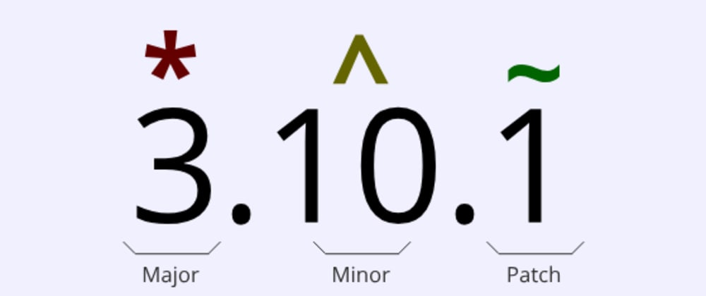

# Versionamento semântico com NPM

--- 

Melhor documentação da vidaaaaaaaaaaaa (não foi o origamid que indicou eu que pesquisei) essa aqui: https://dev.to/filipebeck/versionamento-semantico-com-npm-id0

- Copiei o texto p/ ficar mais fácil:

---

Versionamento semântico é um padrão de versionamento de APIs que permite a separação entre mudanças que quebram a compatibilidade com versões anteriores (major), mudanças que adicionam funcionalidades sem quebrar a retrocompatibilidade (minor) e mudanças que não afetam a funcionalidade (patch). Consiste basicamente de 3 números separados por ponto.

## Patch

É o 3° número. Qualquer atualização que não adicione, remova, ou modifique alguma funcionalidade deve incrementar esse dígito. Ex.: correções de bugs.
Se você quiser manter a versão major e minor de sua dependência e atualizar apenas o patch, inclua um ~ antes da versão no arquivo package.json. Ex.: ~3.4.1 - instala ou atualiza a versão 3.4 que contenha o patch mais alto a partir de 1.

## Minor

É o 2° número. Qualquer atualização que adicione funcionalidades sem quebrar o código que usa versões anteriores deve incrementar esse dígito. Ex.: adição de métodos em uma classe.
Se você quiser manter a versão major e atualizar a minor e patch de sua dependência, inclua um ^ antes da versão no arquivo package.json. Ex.: ^3.4.1 - instala ou atualiza a versão 3 que contenha o minor e patch mais alto a partir de 4.1.

## Major

É o 1° número. Qualquer atualização que quebre a retrocompatibilidade deve incrementar esse dígito. Ex.: Remoção de uma função ou a remoção/renomeação de um método de classe.
Se você quiser manter a sua dependência sempre atualizada com a última versão, use um * como versão no arquivo package.json.

Fontes:

Documentação oficial: https://semver.org
Documentação do NPM: https://docs.npmjs.com/about-semantic-versioning
Ferramenta para testar a sintaxe: https://semver.npmjs.com/

----

### Dicas

- Ferramentas de compactação de arquivos: UglifyJs, Terser
- UglifyJs compativel com o ES6 tem que instalar como npm i uglify-js-es6
